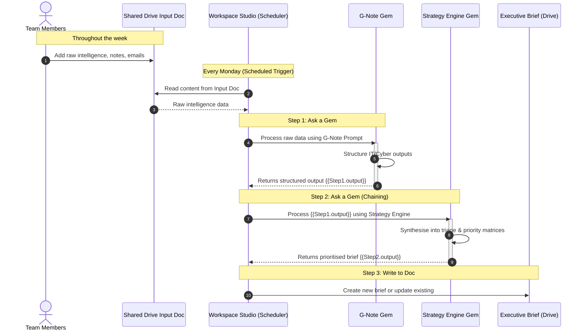
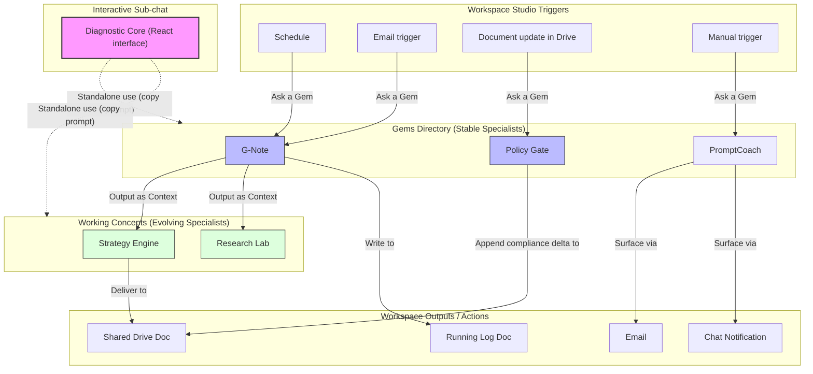

# Gemini AOP (Art of the Possible) Workspace

A WIP collection of Gemini Gems, prompt frameworks, and experimental concepts - designed for use directly in Google Workspace Studio or standalone via Gemini.

---

## What Is This?

A WIP **prompt engineering workspace** - a living library of LLM tools and frameworks, not a finished product.

Each component is designed to be:
- Used as a standalone Gem in Gemini
- Composed with other Gems in **Workspace Studio flows** (scheduled triggers, document inputs, multi-step pipelines)
- Adapted and extended as your team's needs evolve

---

## Workspace Studio Integration

Workspace Studio lets you orchestrate Gems into automated multi-step flows. A Gem is not just a chat tool - it can act as a **processing node** in a pipeline:

| Flow Pattern | Example |
|---|---|
| Schedule → Gem → Doc | Daily threat briefing written to a shared Drive doc |
| Email trigger → Gem → Summary | Meeting notes enriched by G-Note, appended to a running log |
| Gem → Gem | G-Note output fed as context into Strategy Engine |
| Manual trigger → Gem → Notification | Policy Gate evaluation surfaced via Chat or email |

Wire any Gem into a Studio flow using the **Ask a Gem** step. Only private Gems with no attachments (or Drive-only attachments) are supported in flows.

---

## Directory Overview

### `Gems/`

Stable Gems for direct use or Studio integration.

| Gem | Purpose |
|---|---|
| **G-Note** | Enriches raw intelligence from meeting notes, emails, and informal sources into structured IT/Cyber outputs |
| **Policy Gate** | Evaluates policies against Australian and international frameworks (Essential Eight, ISO 27001, NIST CSF) |
| **PromptCoach** | Elevates LLM prompts through structured coaching and iterative drafting - v1 and v2 available |

### `Interactive sub-chat/`

A React interface for Gemini Canvas implementing a **Diagnostic Core** - a terrible name for a sub-chat layer that surfaces and resolves ambiguity before passing context to a Gem or flow.

### `Working_Concepts/`

Functional but evolving.

| Concept | Purpose |
|---|---|
| **Strategy Engine** | Synthesises G-Note outputs into executive triage and priority matrices |
| **Research Lab** | Structured scorecard for vendor evaluations and technical deep dives |

---

## Key Files

| File | Description |
|---|---|
| `Gems/Note/G-Note_Prompt.md` | G-Note master prompt |
| `Gems/Policy_Gate/Prompt.md` | Policy Gate master prompt |
| `Gems/PromptCoach/Prompt.md` + `Prompt.v2.md` | PromptCoach and Expert Creator prompts |
| `Gems/WIP_Concepts/Strategy_Engine/Strategy_Engine_Prompt.md` | Strategy Engine prompt |
| `Gems/WIP_Concepts/Research_Lab/Research_Lab_Prompt.md` | Research Lab prompt |
| `Interactive sub-chat/interactive.tsx` | React diagnostic interface |

---

## Usage

1. **Standalone** - Copy any prompt into a Gemini Gem and use it interactively.
2. **Studio flow** - Wire a Gem into a scheduled or triggered flow via the **Ask a Gem** step. Pass variables from earlier steps as context.
3. **Chained** - Use one Gem's output as the next Gem's input (e.g. G-Note → Strategy Engine).
4. **Extended** - Fork any prompt in `Working_Concepts/` and adapt it for your frameworks, tone, or data sources.

---

## Concept Ideation

Current capabilities and where they could go - for both technical and non-technical contributors.

---

### What Could This Become?

Think of each Gem as a specialist you can summon on demand - one that already knows your security frameworks, document style, and organisational priorities.

**Weekly Situational Awareness Brief**
A scheduled Studio flow that pulls from a shared inputs doc, runs it through G-Note, then feeds it into Strategy Engine to produce a prioritised executive brief - delivered to Drive every Monday.

**Onboarding Intelligence Pack**
A Gem that takes a new team member's role, asks a few questions, and produces a tailored reading list, policy summary, and suggested first actions grounded in your ISMS documentation.

**Incident Retrospective Synthesiser**
Takes a raw incident timeline and stakeholder inputs, structures it into a Post-Incident Review format, and maps findings to framework controls - ready for the ISWG or an auditor.

**Policy Lifecycle Tracker**
A Studio flow triggered when a policy doc updates in Drive, running it through Policy Gate and appending a compliance delta - flagging what changed and whether framework alignment is affected.

---

### Architecture and Extension Opportunities

**Current shape:**
- Gems are stateless prompt wrappers - context must be injected per-run
- Studio flows are the composition layer: trigger → steps → output
- `interactive.tsx` is a standalone React component, not yet connected to a Gem or backend
- All prompts are Markdown - portable to any LLM, not Gemini-locked

**Extension directions:**

**Gem chaining via Studio variables**
G-Note and Strategy Engine are designed to work in sequence. Pass `{{Step2.output}}` directly into the Strategy Engine prompt - no code required.

**Apps Script bridge**
An Apps Script trigger on a shared "intelligence inbox" doc can fire a Studio flow whenever a new entry is appended, routing output to a structured log doc - near-real-time enrichment without a backend.

**Diagnostic Core as a pre-processor**
Connect `interactive.tsx` to a Cloud Run or Cloud Functions proxy to act as a context resolution layer before any Gem is invoked - surfaces ambiguity, confirms intent, passes a clean prompt downstream.

**Parameterised framework selection in Policy Gate**
Accept a `{{frameworks}}` variable at runtime so scope can differ between a DISP review and an ISO 27001 surveillance audit without editing the prompt.

**Structured JSON output**
Add a JSON schema instruction to G-Note or Strategy Engine outputs - enabling results to be parsed into Sheets, Jira, or a dashboard rather than a doc.

**Version-controlled prompt registry**
A lightweight YAML manifest mapping Gem name → prompt version → Studio flow ID → owner. Useful for audit trails under ISO 27001 A.8.

